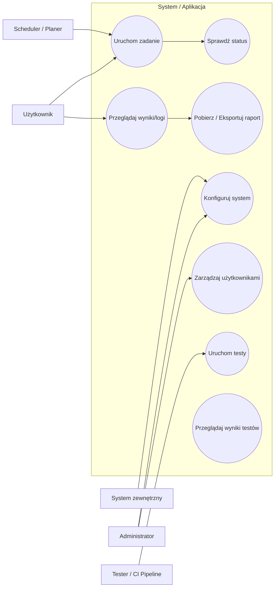

```mermaid
graph LR
    subgraph "System / Aplikacja"
        UC1((Uruchom zadanie))
        UC2((Sprawdź status))
        UC3((Przeglądaj wyniki/logi))
        UC4((Pobierz / Eksportuj raport))
        UC5((Konfiguruj system))
        UC6((Zarządzaj użytkownikami))
        UC7((Uruchom testy))
        UC8((Przeglądaj wyniki testów))
    end

    User["Użytkownik"]
    Admin["Administrator"]
    Scheduler["Scheduler / Planer"]
    Tester["Tester / CI Pipeline"]
    External["System zewnętrzny"]

    User --> UC1
    Scheduler --> UC1
    UC1 --> UC2

    User --> UC3
    UC3 --> UC4

    Admin --> UC5
    External --> UC5
    Admin --> UC6

    Tester --> UC7
```
    Tester --> UC8
    UC7 --> UC8
