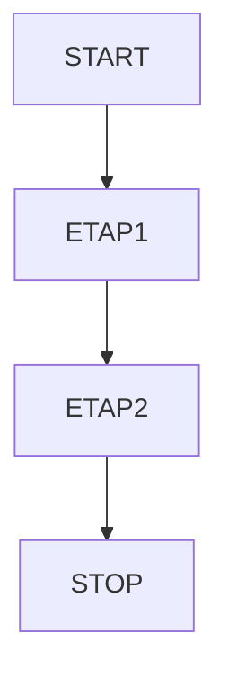
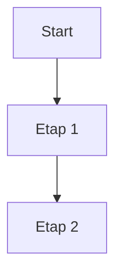

Do zrobienia:
- [ ] zadanie 1
- [x] zadanie 2 

| Syntax | Description |
| ----------- | ----------- |
| Header | Title |
| Paragraph | Text |

# Bardzo duży nagłówek
jakiś zwykły tekst
**pogrubiony tekst** dalej tekst bez pogrubienia *a tu kursywa*
## Trochę mniejszy nagłówek
kolejny tekst
### Najmniejszy nagłówek
ostatni tekst
- pierwszy element
- drugi element list
    - podpunkt
 
  jakis tekst <pre>fragment kodu</pre> w ramach tekstu


  ```
  tutaj też może być kod
  ```

[tutaj jest link](https://www.merito.pl/)


1. First item
  a. test 
2. Second item
3. Third item
